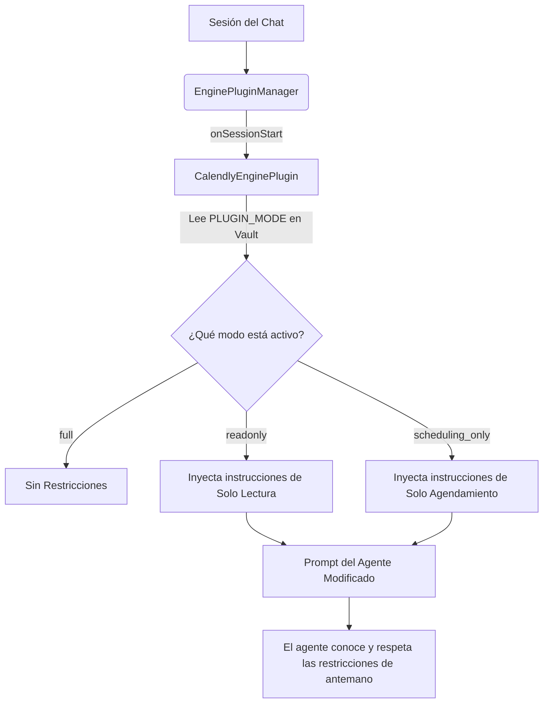

<div align="center">
  
  
  # 📅 Calendly AI Plugin — Urano Hybrid MCP

  [](https://github.com/uranotools/UranoDesktop)
  [](https://github.com/uranotools/calendly-plugin)
  [](https://opensource.org/licenses/MIT)

  **El plugin definitivo de productividad para agendar, gestionar y automatizar reuniones en Calendly de manera 100% conversacional.**

  *Perfectamente integrado como MCP Tool Provider e inyección dinámica a través de Urano Engine Plugin.*
</div>

---

## ✨ Capacidades

| Plugin | Herramientas MCP | Descripción |
|--------|-----------------|-------------|
| **User** | `getProfile` | Perfil del usuario autenticado (timezone, URL de agenda, URI) |
| **EventTypes** | `list`, `getDetails` | Tipos de reuniones configurados en Calendly |
| **Events** | `listToday`, `listThisWeek`, `listUpcoming`, `getDetails`, `cancel` | Eventos agendados con atajos por día/semana |
| **Invitees** | `list`, `getDetails` | Invitados por evento con sus respuestas |
| **Scheduling** | `generateLink`, `listLinks` | Links únicos de agendamiento (one-time o multi-uso) |
| **Availability** | `check` | Horarios disponibles para un tipo de evento en un rango de fechas |
| **Webhooks** | `list`, `create`, `delete` | Suscripciones de webhook en tiempo real |

**Total: 16 herramientas MCP** registradas bajo el namespace `urano_calendly_*`

---

## ⚡ Arquitectura Híbrida Premium

Este plugin no es solo un conjunto de herramientas MCP convencionales. Se ejecuta como un **Engine Plugin híbrido de Urano**, integrándose directamente en el ciclo de vida de la conversación (`RuntimeLoop`):



### Beneficios del Engine Plugin Dinámico:
1. **Auto-Consciencia del Agente**: En lugar de descubrir las limitaciones cuando falla una API, el agente sabe de antemano qué puede y qué no puede ofrecer basándose en tu configuración guardada.
2. **Políticas Proactivas**: El agente rechazará de manera proactiva acciones destructivas (como cancelaciones) explicándote el modo activo de forma amigable.
3. **Cero Fugas de Seguridad**: Aunque el agente intente saltarse el prompt del sistema, las llamadas de herramientas MCP reales están protegidas mediante el middleware estricto `mode-guard` que audita cada petición en tiempo de ejecución.

---

## 🚀 Instalación en Urano

### Modo Desarrollador (Dev Mode — recomendado para desarrollo)

1. Abre **Urano Desktop → MCP Manager → Pestaña "Desarrollador"**.
2. Haz clic en **"Vincular Carpeta Local"**.
3. Selecciona esta carpeta (`calendly-aiplugin/`).
4. Urano creará un symlink y activará hot-reload automático.

### Instalación desde ZIP (Producción)

1. Instala dependencias de build:
   ```bash
   npm install
   ```
2. Compila el bundle:
   ```bash
   npm run build
   ```
3. Ejecuta la tarea de empaquetado para generar el archivo de distribución:
   ```bash
   npm run urano-launch
   ```
4. En **Urano → MCP Manager → Instalar MCP (.zip)**, sube el archivo `calendly-aiplugin.zip` generado en el directorio raíz.

---

## ⚙️ Configuración

Una vez instalado, ve a **MCP Manager → Calendly → Configuración** y completa:

| Campo | Tipo | Descripción |
|-------|------|-------------|
| `PLUGIN_MODE` | 🔒 Selector | **Modo de Operación** — controla qué puede hacer el agente (ver tabla abajo) |
| `CALENDLY_TOKEN` | 🔒 Password (Bóveda) | Tu **Personal Access Token** de Calendly. Obtenlo en [Calendly → Integraciones → API & Webhooks](https://calendly.com/integrations/api_webhooks) |
| `CALENDLY_ORG_URI` | Texto | URI de organización *(opcional — se autodetecta desde tu perfil)* |
| `DEFAULT_EVENT_COUNT` | Selector | Número de eventos a listar por defecto (10 / 25 / 50 / 100) |

### 🔒 Modos de Operación

| Modo | Valor | Herramientas disponibles |
|------|-------|--------------------------|
| ✅ Manejo Personal Completo | `full` | Todas las 16 herramientas |
| 👁️ Solo Lectura | `readonly` | Listar, consultar, ver disponibilidad — sin cancelar, crear webhooks ni generar links |
| 🤖 Solo Automatizaciones | `scheduling_only` | `getProfile`, tipos de evento (listar/detalle), generar links, ver disponibilidad |

> **¿Cuándo usar cada modo?**
> - **`full`**: Para uso personal donde el agente gestiona tu agenda completamente.
> - **`readonly`**: Para agentes de reporte o dashboards que solo necesitan consultar.
> - **`scheduling_only`**: Para bots de automatización que solo deben generar links de agendamiento (ej. CRM, chatbots de ventas).

> **Nota de seguridad:** El token se almacena cifrado en la Bóveda local de Urano. El agente nunca accede al token directamente — Urano lo inyecta en tiempo de ejecución de forma transparente.


---

## 🏗️ Estructura del Proyecto

```
📁 calendly-aiplugin/
├── 📄 config.ts                         ← Manifiesto del módulo MCP
├── 📄 SKILL.md                          ← Instrucciones para el agente
├── 📄 package.json                      ← Dependencias y scripts de build
├── 📄 tsconfig.json                     ← Config TypeScript (silencia errores @core)
├── 📄 urano.d.ts                        ← Tipos de módulos internos de Urano
├── 📄 calendly-aiplugin.zip             ← Archivo de distribución del Plugin
└── 📁 Plugins/
    ├── 📁 Engine/
    │   └── 📄 CalendlyEnginePlugin.ts   ← Engine Plugin (inyección dinámica de prompt)
    ├── 📁 User/
    │   └── 📄 UserPlugin.ts             ← Perfil del usuario autenticado
    ├── 📁 EventTypes/
    │   └── 📄 EventTypesPlugin.ts       ← Tipos de reuniones (event types)
    ├── 📁 Events/
    │   └── 📄 EventsPlugin.ts           ← Eventos agendados (CRUD + atajos)
    ├── 📁 Invitees/
    │   └── 📄 InviteesPlugin.ts         ← Invitados por evento
    ├── 📁 Scheduling/
    │   └── 📄 SchedulingPlugin.ts       ← Generación de links de agendamiento
    ├── 📁 Availability/
    │   └── 📄 AvailabilityPlugin.ts     ← Consulta de horarios disponibles
    └── 📁 Webhooks/
        └── 📄 WebhooksPlugin.ts         ← Gestión de webhooks en tiempo real
```

---

## 💬 Ejemplos de Uso con el Agente

```
👤 "¿Qué reuniones tengo hoy?"
🤖 → [urano_calendly_events_listtoday] → Lista formateada con hora local

👤 "¿Estoy libre el jueves a las 3 PM para una demo de 30 min?"
🤖 → [urano_calendly_eventtypes_list] + [urano_calendly_availability_check] → Confirmación

👤 "Manda un link para que Juan agende una llamada de 30 min conmigo"
🤖 → [urano_calendly_eventtypes_list] + [urano_calendly_scheduling_generatelink] → Link único

👤 "Cancela mi reunión del viernes con Ana"
🤖 → [urano_calendly_events_listthisweek] → Identifica el evento
    → Pide confirmación explícita
    → [urano_calendly_events_cancel]

👤 "¿Cuántas reuniones tuve esta semana y quiénes vinieron?"
🤖 → [urano_calendly_events_listthisweek] + [urano_calendly_invitees_list × N]
```

---

## 🛡️ Seguridad y Rate Limiting

- **Rate limiter integrado:** Cola serial con ~85 req/min (margen sobre el límite de Calendly de 100/min).
- **Timeout por request:** 15 segundos con `AbortController` para evitar bloqueos de cola.
- **Retry automático en 429:** Respeta el header `Retry-After` de Calendly antes de reintentar.
- **Acciones destructivas:** `cancel` y `webhooks_delete` requieren confirmación explícita del usuario (definido en `SKILL.md`).

---

## 🔧 Herramientas MCP Registradas

| Herramienta MCP | Plugin | Acción |
|----------------|--------|--------|
| `urano_calendly_user_getprofile` | User | getProfile |
| `urano_calendly_eventtypes_list` | EventTypes | list |
| `urano_calendly_eventtypes_getdetails` | EventTypes | getDetails |
| `urano_calendly_events_listupcoming` | Events | listUpcoming |
| `urano_calendly_events_listtoday` | Events | listToday |
| `urano_calendly_events_listthisweek` | Events | listThisWeek |
| `urano_calendly_events_getdetails` | Events | getDetails |
| `urano_calendly_events_cancel` | Events | cancel |
| `urano_calendly_invitees_list` | Invitees | list |
| `urano_calendly_invitees_getdetails` | Invitees | getDetails |
| `urano_calendly_scheduling_generatelink` | Scheduling | generateLink |
| `urano_calendly_scheduling_listlinks` | Scheduling | listLinks |
| `urano_calendly_availability_check` | Availability | check |
| `urano_calendly_webhooks_list` | Webhooks | list |
| `urano_calendly_webhooks_create` | Webhooks | create |
| `urano_calendly_webhooks_delete` | Webhooks | delete |

---

## 📋 Requisitos

- **Urano Desktop** ≥ 1.3.5
- **Node.js** ≥ 18 (solo para build)
- **Cuenta Calendly** con Personal Access Token activo
- Conexión a internet (llama a `https://api.calendly.com`)

---

## 📦 Publicación en Marketplace

Para publicar en el Marketplace de Urano, crea un Release en GitHub con tu `Calendly.zip` compilado y envía un PR al registro oficial añadiendo:

```json
{
  "id": "Calendly",
  "name": "Calendly",
  "description": "Gestión completa de agenda con Calendly desde el agente.",
  "version": "1.0.0",
  "category": "Productividad",
  "icon": "Calendar",
  "tags": ["agenda", "scheduling", "productividad", "reuniones"],
  "downloadUrl": "https://github.com/tu-usuario/calendly-aiplugin/releases/download/v1.0.0/Calendly.zip",
  "verified": false
}
```
